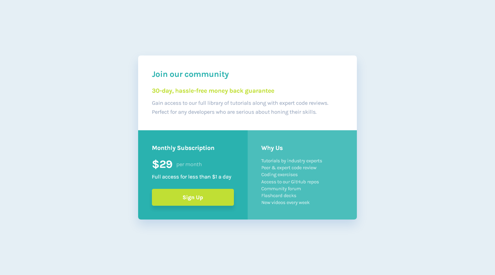

# My twelvth project and solution for [Frontend Mentor's](https://www.frontendmentor.io/challenges) simple HTML & CSS challenges using a mobile first approach.  

## Table of contents
- [The challenge](#the-challenge)
- [Goals](#goals)
- [Assignment design](#this-was-the-design)
- [My solution with live page link](#this-is-my-solution)
- [What I learned](#what-i-learned)
- [Tools used](#tools-used)

## The challenge

My challenge is to build out this four card feature section and get it looking as close to the design as possible.

I can use any tools I like to help me complete the challenge. So if I've got something I'd like to practice, I can feel free to give it a go.

My users should be able to:

- [x] View the optimal layout depending on their device's screen size
- [x] See a hover state on desktop for the Sign Up call-to-action

## Goals

My goals for this project were to:

- [x] Use a mobile first approach
- [x] Code cleanly
- [x] Comment my code if I use a non-standard approach
- [x] Use CSS Variables
- [x] Use CSS Grid in combination with Flexbox to create the layout

I used this opportunity to further practice CSS grids and a mobile first approach meaning I started coding the CSS by coding the style for the mobile version first then moving up to the desktop design with conditional CSS.

## This was the design

## This is my solution

[Click here to see the live page](https://arthurpog.github.io/social-proof-section/)

## What I learned

I spent a lot of time examining the display property and trying to understand each value better. I still have a ways to go when it comes to Flexbox and Grid but I learned that every web element is basically a box model. Even inline elements.

I learned these new properties:
- `writing-mode`
- `margin-block`
- `margin-inline`

I found out that HTML elements come with {default style applied to them by browsers](https://www.w3schools.com/csSref/css_default_values.asp) so I printed all of them out and put them in my HTML notebook for future reference.

By understanding Inline, Block and Inline-Block values better I also managed to delete the annoying space between inline elements such as two 
 tags with a display property of `inline-block` by putting a comment in between like so:
  `
`
  `  Lorem ipsum`
  `
<!--`
  `-->
`
  `  Lorem ipsum`
  `
`

## Tools used

- **VS Code** with a few extensions:
  - **CSS Peek** - To immediately see what certain variables that I set mean and their values by holding CRTL + hovering over the value
  - **HTML to CSS Autocompletion** - Quickly autocomplete classes and ID names in CSS based on what I created in HTML
  - **Live Preview** - Right-clicking the index.html offers to view a live and constantly auto-updated version of the web-page for a quick live view of one's work
- **Greenshot** - A fantastic little open-source tool that is like a screenshot on steroids. After pressing PrtScrn it lets one exactly measure the width and height of an element on a screen basically making it very easy to calculate how big certain margins, paddings, containers and font-sizes are in a design without having access to a wire-frame.
- **Microsoft PowerToys** - A nifty little program from Microsoft adding a *plethora* of UI functionality to Windows. What I use most for coding is CTRL+WIN+C it brings up a colour picker, and when I hover over something or click something it shows me the HEX, RGB, HSL and CMYK values of the colour that can instantly be copied to the clipboard and in addition to this it keeps a history of all the colours picked. Amazing!
